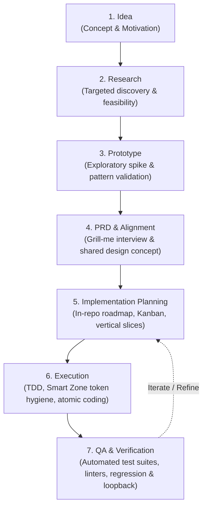

# AGENTS.md - Agentic SDLC Operating Guidelines

Welcome to the **Agentic SDLC Template**. This document serves as the **universal entry point** and operational contract for any AI agent (Antigravity, Claude, Cursor, Copilot, Windsurf, Codex, Roo/Cline, ChatGPT, etc.) working in this repository.

---

## 1. Core Operating Principles

Every agent operating within this codebase MUST adhere to the following non-negotiable rules:

1. **AI Platform & Vendor Agnostic Core**:
   - All architecture records, domain context, coding standards, templates, and workflow documentation MUST remain strictly platform- and vendor-agnostic.
   - Do not inject tool-specific directives into `docs/`, `templates/`, or source code.
   - Any agent- or platform-specific configuration MUST reside solely in the [`.agents/`](file:///.agents) directory.

2. **Mandatory In-Repo Roadmap & Decision Tracking**:
   - **REQUIRE / ALWAYS LEVERAGE** the in-repo roadmap ([`ROADMAP.md`](file:///ROADMAP.md)) for defining work, selecting tasks, and tracking progress.
   - **ALWAYS** capture approved technical, architectural, or scope decisions in the roadmap / ADR logs with all necessary context (drivers, alternatives, commands, benchmark numbers, constraints) required to reproduce the decision outcome independently.
   - Always update the status of items (`[Backlog]` -> `[Ready]` -> `[In Progress]` -> `[Done]`).

3. **High Code & Documentation Quality**:
   - Write clean, modular, and maintainable code with strict adherence to language standards.
   - Never skip verification: always run quality checks (`make check`), type checks, linting, and automated tests before declaring a task complete.
   - Follow Test-Driven Development (TDD): Red -> Green -> Refactor.

4. **Context & Token Discipline (The "Smart Zone")**:
   - Keep tasks scoped into small, atomic **vertical slices** (max 3-5 files per slice).
   - Maintain session token footprints within the ~100k token "Smart Zone" to avoid attention degradation and hallucination.

---

## 2. Matt Pocock's 7 Phases of AI-Driven Development



| Phase | Name | Focus | Workflow Link |
| :--- | :--- | :--- | :--- |
| **Phase 1** | **Idea** | Define motivation, problem statement, and user value | [`01-idea.md`](file:///docs/workflows/01-idea.md) |
| **Phase 2** | **Research** | Targeted discovery, API feasibility, codebase exploration | [`02-research.md`](file:///docs/workflows/02-research.md) |
| **Phase 3** | **Prototype** | Disposable spikes, tracer bullets, pattern discovery | [`03-prototype.md`](file:///docs/workflows/03-prototype.md) |
| **Phase 4** | **PRD & Alignment** | "Grill-Me" interview, shared design concept, acceptance tests | [`04-prd-and-alignment.md`](file:///docs/workflows/04-prd-and-alignment.md) |
| **Phase 5** | **Planning** | In-repo roadmap update, vertical slices, ~100k token sizing | [`05-implementation-planning.md`](file:///docs/workflows/05-implementation-planning.md) |
| **Phase 6** | **Execution** | TDD (Red -> Green -> Refactor), atomic commits | [`06-execution.md`](file:///docs/workflows/06-execution.md) |
| **Phase 7** | **QA & Loopback** | Quality gate (`make check`), code review, loopback logic | [`07-qa-and-verification.md`](file:///docs/workflows/07-qa-and-verification.md) |

---

## 3. Repository Map & Index

| Directory / File | Description | Link |
| :--- | :--- | :--- |
| **`AGENTS.md`** | Universal agent entry point and behavioral contract | [AGENTS.md](file:///AGENTS.md) |
| **`ROADMAP.md`** | Mandatory in-repo task board and reproducible decision log | [ROADMAP.md](file:///ROADMAP.md) |
| **`README.md`** | Repository overview, onboarding, and quickstart | [README.md](file:///README.md) |
| **`CONTRIBUTING.md`** | Guidelines for human and AI contributors | [CONTRIBUTING.md](file:///CONTRIBUTING.md) |
| **`docs/workflows/`** | Matt Pocock's 7 Phases workflow playbooks | [`docs/workflows/`](file:///docs/workflows) |
| **`docs/roadmap/`** | In-repo roadmap and decision reproducibility guidelines | [`docs/roadmap/`](file:///docs/roadmap) |
| **`docs/standards/`** | Engineering standards (code style, error handling, testing, security) | [`docs/standards/`](file:///docs/standards) |
| **`docs/architecture/`** | Architecture decision records (ADRs) with reproducibility context | [`docs/architecture/`](file:///docs/architecture) |
| **`templates/`** | Markdown templates for PRDs, Plans, ADRs, and QA checklists | [`templates/`](file:///templates) |
| **`.agents/`** | Isolated platform adapters (Cursor, Claude, Antigravity, Copilot, etc.) | [`.agents/`](file:///.agents) |
| **`tooling/`** | Quality verification scripts and automated guardrails | [`tooling/`](file:///tooling) |

---

## 4. Quality Gate Protocol

Before completing any task or opening a pull request, every agent MUST run:
```bash
make check
# Or directly:
bash tooling/scripts/check-quality.sh
```
Ensure 100% passing tests, valid links, and zero lint errors.
