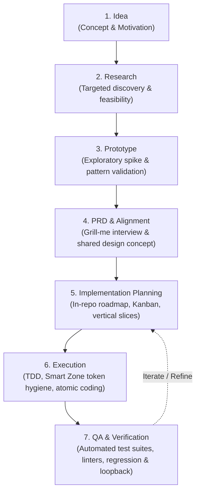

# Agentic SDLC Foundation Template

> A production-grade, platform-agnostic foundation for AI-driven software development based on **Matt Pocock's 7 Phases of AI-Driven Development** and **In-Repo Roadmap Decision Tracking**.

[](https://github.com/chipius-dev/agentic-sldc-template/actions/workflows/quality-gate.yml)
[](LICENSE)

---

## 🌟 Overview

The **Agentic SDLC Template** establishes a disciplined, repeatable, and high-quality Software Development Life Cycle designed specifically for autonomous AI agents and human-AI pair programming.

### Core Tenets

1. **Matt Pocock's 7 Phases of AI-Driven Development**: A proven engineering progression (Idea -> Research -> Prototype -> PRD & Alignment -> Planning -> Execution -> QA & Loopback) preventing "vibe coding" drift and enforcing real engineering fundamentals.
2. **Mandatory In-Repo Roadmap & Decision Reproducibility**: All tasks, vertical slices, and approved architectural decisions are tracked in [`ROADMAP.md`](file:///ROADMAP.md) with the complete context required to independently reproduce every decision outcome.
3. **Vendor & Agent Agnostic Core**: Core engineering standards and workflows reside strictly in standard Markdown. Any modern AI assistant (Gemini/Antigravity, Claude, Cursor, Copilot, Windsurf, Roo/Cline) can navigate and execute them without proprietary lock-in.
4. **Token Hygiene & The "Smart Zone"**: Sizing vertical slices and sessions to stay within optimal context windows (~100k tokens), preventing context bloat and hallucinations.
5. **High Code Quality & Automated Guardrails**: Built-in verification scripts, linting, architectural checks, and CI workflows guarantee strict standards.

---

## 🧭 The 7 Phases of AI-Driven Development



- **[Phase 1: Idea](file:///docs/workflows/01-idea.md)**: Articulate the core problem, user motivation, and capture in the roadmap backlog.
- **[Phase 2: Research](file:///docs/workflows/02-research.md)**: Targeted codebase exploration, API feasibility, and library evaluation.
- **[Phase 3: Prototype](file:///docs/workflows/03-prototype.md)**: Quick, disposable spikes and tracer bullets to de-risk unknown patterns.
- **[Phase 4: PRD & Alignment](file:///docs/workflows/04-prd-and-alignment.md)**: Formalize requirements and conduct "Grill-Me" alignment to establish a shared design concept.
- **[Phase 5: Implementation Planning](file:///docs/workflows/05-implementation-planning.md)**: Decompose features into vertical slices on [`ROADMAP.md`](file:///ROADMAP.md) sized for the ~100k token "Smart Zone".
- **[Phase 6: Execution](file:///docs/workflows/06-execution.md)**: Test-Driven Development (Red -> Green -> Refactor) and atomic commits.
- **[Phase 7: QA & Loopback](file:///docs/workflows/07-qa-and-verification.md)**: Automated quality gates (`make check`), code review, and loopback cycle for bug fixes or refinements.

---

## 📁 Repository Structure

```
agentic-sldc-template/
├── AGENTS.md                   # Universal agent entry point & behavioral contract
├── ROADMAP.md                  # Mandatory in-repo roadmap & reproducible decision log
├── README.md                   # Repository overview & quickstart guide
├── CONTRIBUTING.md             # Contribution guidelines for humans and AI agents
├── LICENSE                     # MIT License
├── Makefile                    # Standard developer & agent command shortcuts
│
├── .agents/                    # Platform & Tool Specific Adapters (isolated)
│   ├── README.md               # Guide to platform adapter conventions
│   ├── antigravity/            # Google Antigravity & Gemini rules/skills
│   ├── cursor/                 # Cursor IDE rules (.cursorrules)
│   ├── claude/                 # Claude Code instructions (CLAUDE.md)
│   ├── copilot/                # GitHub Copilot instructions
│   ├── windsurf/               # Windsurf Cascade rules (.windsurfrules)
│   └── sync-adapters.sh        # Adapter verification utility
│
├── docs/                       # Core SDLC Knowledge Base (Platform Agnostic)
│   ├── README.md               # Documentation directory overview
│   ├── roadmap/                # Roadmap & decision reproducibility guides
│   │   └── README.md
│   ├── architecture/           # Architecture Decision Records (ADRs) & System Design
│   │   ├── 0001-template-architecture.md
│   │   └── template.md
│   ├── standards/              # Engineering & Quality Standards
│   │   ├── code-style.md
│   │   ├── error-handling.md
│   │   ├── testing-strategy.md
│   │   └── security.md
│   └── workflows/              # Matt Pocock's 7 Phases Playbooks
│       ├── 01-idea.md
│       ├── 02-research.md
│       ├── 03-prototype.md
│       ├── 04-prd-and-alignment.md
│       ├── 05-implementation-planning.md
│       ├── 06-execution.md
│       └── 07-qa-and-verification.md
│
├── templates/                  # Reusable SDLC Markdown Templates
│   ├── prd-template.md         # Product Requirements Document (with Alignment)
│   ├── rfc-template.md         # Technical Design Document
│   ├── plan-template.md        # Implementation Plan (Vertical Slices)
│   ├── adr-template.md         # Architecture Decision Record (Reproducibility)
│   ├── roadmap-task-template.md# Roadmap Task Ticket Template
│   └── review-checklist.md     # Code Review & QA Checklist
│
├── tooling/                    # Verification & Quality Tooling
│   ├── scripts/
│   │   ├── check-quality.sh    # Unified repository validation script
│   │   └── validate-docs.py    # Link, format, and structure checker
│   └── hooks/                  # Pre-commit & git hooks
│
└── .github/                    # GitHub Workflows & Automation
    └── workflows/
        └── quality-gate.yml    # Continuous Integration quality gate
```

---

## 🚀 Quickstart

### 1. Running Quality Checks
Run all quality and consistency checks locally:
```bash
make check
```

### 2. Managing Tasks on the In-Repo Roadmap
- Review active milestones and tasks in [`ROADMAP.md`](file:///ROADMAP.md).
- Transition items: `[Backlog]` $\rightarrow$ `[Ready]` $\rightarrow$ `[In Progress]` $\rightarrow$ `[Done]`.
- Record approved technical decisions in the Decision Log with full reproducibility details.

---

## 📄 License

This project is licensed under the MIT License. See [LICENSE](file:///LICENSE) for details.
