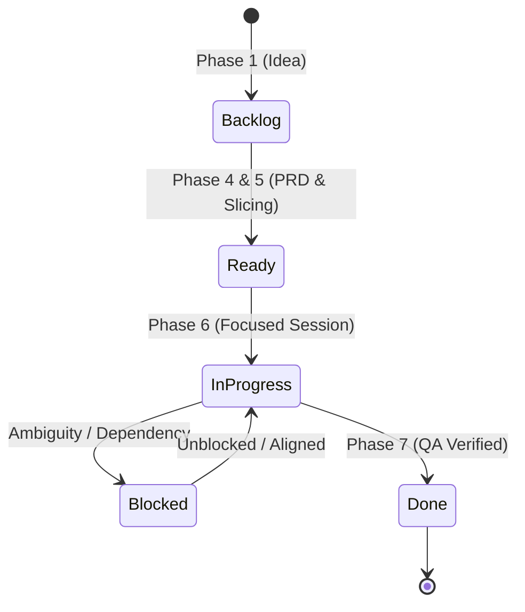

# In-Repo Roadmap & Decision Tracking Guidelines

This document defines the mandatory protocol for managing work and recording decision outcomes using the in-repo roadmap ([`ROADMAP.md`](file:///ROADMAP.md)) in any downstream or implementor repository.

---

## 🚨 Non-Negotiable Mandate for AI Agents

In any implementor repository created from or using this template:

> **EVERY AI AGENT MUST ALWAYS USE AND UPDATE THE IN-REPO ROADMAP ([`ROADMAP.md`](file:///ROADMAP.md)) FOR ALL WORK.**

### Agent Rules:
1. **Never Start Unanchored Work**:
   - Before writing or modifying any code, the AI agent MUST check [`ROADMAP.md`](file:///ROADMAP.md) to identify the target milestone, epic, and specific vertical slice task.
   - If a requested task does not yet exist on the roadmap, the agent MUST add it to `[Ready]` or `[Backlog]` before commencing work.
2. **Real-Time State Transitions**:
   - The agent MUST transition the task status as work progresses:
     - `[Backlog]` $\rightarrow$ Idea captured (Phase 1)
     - `[Ready]` $\rightarrow$ PRD & vertical slice defined (Phase 4 & 5)
     - `[In Progress]` $\rightarrow$ Actively implementing in focused session (Phase 6)
     - `[Blocked]` $\rightarrow$ Waiting on human input or external dependency
     - `[Done]` $\rightarrow$ Fully verified with tests & `make check` passing (Phase 7)
3. **Mandatory Decision Reproducibility Logging**:
   - Whenever an architectural, technical, or scope decision is approved, the agent MUST record it in the **Approved Decisions & Reproducibility Log** section of [`ROADMAP.md`](file:///ROADMAP.md) (and/or in [`docs/architecture/`](file:///docs/architecture)).
   - The log entry MUST contain all context (drivers, evaluated options, trade-offs, commands, benchmarks, constraints) required for any other agent or human to reproduce and verify the decision outcome independently.

---

## 🚦 Task Lifecycle & Sizing ("Smart Zone")



- **Vertical Slice Sizing**: Each task ticket in [`ROADMAP.md`](file:///ROADMAP.md) must represent a thin, vertical slice of functionality (schema $\rightarrow$ service $\rightarrow$ endpoint/CLI $\rightarrow$ tests), touching no more than **3-5 files**.
- **The ~100k Token Smart Zone**: Sizing tasks into vertical slices keeps execution sessions concise and prevents AI context window bloat, hallucinations, and degraded reasoning.

---

## 📝 Decision Reproducibility Schema

When recording an approved decision in [`ROADMAP.md`](file:///ROADMAP.md) or [`docs/architecture/`](file:///docs/architecture), the agent MUST use this schema:

```markdown
### DEC-XXX: [Descriptive Decision Title]
- **Date**: YYYY-MM-DD
- **Status**: Approved | Superseded | Deprecated
- **ADR / Spec Reference**: [Link to ADR or PRD]
- **Context & Drivers**: [What problem, constraints, or performance requirements drove this decision?]
- **Alternatives Evaluated**:
  1. *[Option A]*: [Pros / Cons / Reason for Rejection]
  2. *[Option B]*: [Pros / Cons / Reason for Selection]
- **Decision Outcome**: [Exact approved architecture, API contract, or library choice]
- **Reproducibility Context**: [Specific commands, benchmark figures, test scripts, or environment details required to independently reproduce and verify this decision outcome]
```
