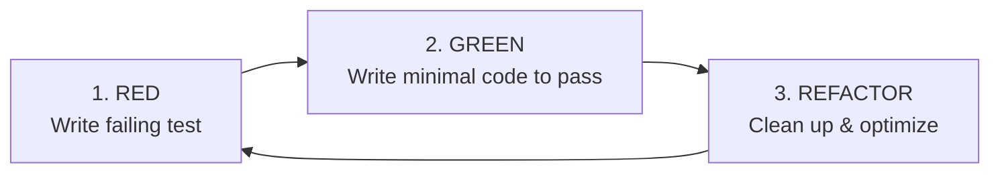

# Phase 6: Execution (TDD, Token Hygiene & Atomic Coding)

The **Execution Phase** turns each planned vertical slice into tested, working software. By practicing Test-Driven Development (TDD) and strict token hygiene, agents and engineers build production-quality code incrementally.

---

## 🎯 Objectives
- Execute vertical slice tasks systematically, moving items from `[Ready]` to `[In Progress]` to `[Done]` in [`ROADMAP.md`](file:///ROADMAP.md).
- Follow Test-Driven Development (Red-Green-Refactor).
- Adhere to engineering standards in [`docs/standards/`](file:///docs/standards).
- Maintain clean, atomic commits and isolated diffs.

---

## 🔴🟢🔄 Test-Driven Development (TDD) Protocol

1. **RED**: Write a unit or integration test that asserts the desired behavior and verify that it fails for the right reason.
2. **GREEN**: Write the minimal, cleanest production code necessary to make the test pass.
3. **REFACTOR**: Improve code modularity, variable naming, and readability while keeping the test suite green.

---

## 🤖 Agent Operating Guidelines
1. **Preserve Repository Integrity**:
   - Never opportunistically reformat untouched files.
   - Preserve existing comments, docstrings, and invariants.
2. **Short, Focused Sessions**:
   - Focus on one vertical slice per session.
   - If a session grows large, finalize the current task, commit, and start a fresh session to stay in the **Smart Zone**.
3. **Update In-Repo Roadmap Live**:
   - Transition task status in [`ROADMAP.md`](file:///ROADMAP.md) as work progresses.

---

## 📋 Phase 6 Checklist & Deliverables
- [ ] Task moved to `[In Progress]` in [`ROADMAP.md`](file:///ROADMAP.md) at start
- [ ] Tests written first (Red phase verified)
- [ ] Production code written and verified (Green phase)
- [ ] Code refactored according to [`docs/standards/code-style.md`](file:///docs/standards/code-style.md)
- [ ] Task moved to `[Done]` upon full slice verification
