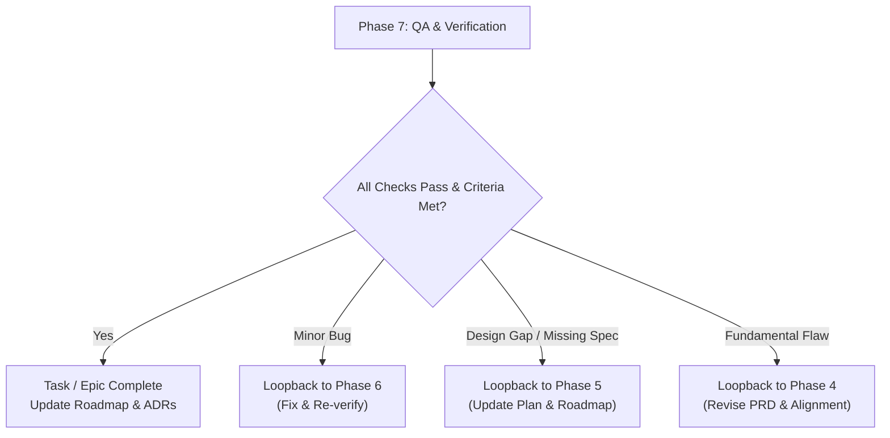

# Phase 7: Quality Assurance, Verification & Loopback

The **QA & Verification Phase** provides the final safety net before merging code or completing an epic. It runs full automated test suites, type checking, security scans, and code reviews, with explicit feedback loops to address any discovered regressions.

---

## 🎯 Objectives
- Run comprehensive repository quality checks (`make check`).
- Perform thorough human and AI code review against [`templates/review-checklist.md`](file:///templates/review-checklist.md).
- Validate that all acceptance criteria from the PRD (Phase 4) are met.
- Execute the **Loopback Cycle** if bugs, regressions, or gaps are discovered.

---

## 🔁 The QA Loopback Protocol



When an issue is discovered in QA:
- **Trivial Bug**: Loop back to **Phase 6 (Execution)** with a new regression test.
- **Missing Task / Unanticipated Dependency**: Loop back to **Phase 5 (Planning)**, add vertical slice to [`ROADMAP.md`](file:///ROADMAP.md), and plan execution.
- **Architectural or Requirement Flaw**: Loop back to **Phase 4 (PRD & Alignment)** to realign on requirements.

---

## 🤖 Agent Operating Guidelines
1. **Always Run Quality Scripts**:
   ```bash
   make check
   # Or directly:
   bash tooling/scripts/check-quality.sh
   ```
2. **Review Like a Staff Engineer**:
   - Inspect diffs for edge cases, performance bottlenecks, race conditions, and documentation freshness.
3. **Capture Decision Outcomes & Retrospectives**:
   - Document any changes made during review directly in the decision log of [`ROADMAP.md`](file:///ROADMAP.md) and [`docs/architecture/`](file:///docs/architecture).

---

## 📋 Phase 7 Checklist & Deliverables
- [ ] `make check` passes with 100% green status
- [ ] Full regression test suite clean
- [ ] All PRD acceptance criteria verified
- [ ] Checklist in [`templates/review-checklist.md`](file:///templates/review-checklist.md) satisfied
- [ ] In-repo [`ROADMAP.md`](file:///ROADMAP.md) updated and approved decisions logged with reproducibility context
