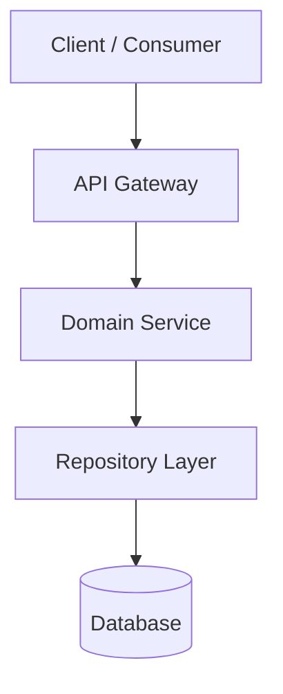

# RFC: [Technical Design / Architecture Proposal Name]

- **Author(s)**: [Author Name / Agent]
- **Status**: [Draft | Review | Accepted | Rejected]
- **Related PRD / Issue**: [Link to PRD or Issue]

---

## 1. Summary & Motivation
[Executive summary of the proposed technical change and why it is necessary.]

---

## 2. System Architecture & Component Design

### Component Details:
1. **API / Interface Layer**: [Endpoints, request/response models, contracts]
2. **Service Layer**: [Core business logic, state machines, transactions]
3. **Data / Persistence Layer**: [Schemas, migrations, indexes, caching]

---

## 3. Alternatives Considered & Trade-offs

| Approach | Pros | Cons | Recommendation |
| :--- | :--- | :--- | :--- |
| **Approach 1 (Proposed)** | High cohesion, zero external dependencies | Requires custom migration logic | **Selected** |
| **Approach 2** | Ready-made third-party library | Vendor lock-in, large binary footprint | Rejected |

---

## 4. Migration, Rollout & Compatibility
- **Backward Compatibility**: [Does this break existing APIs or schemas?]
- **Feature Flags**: [Is this behind a toggle or staged rollout?]
- **Data Migration**: [Step-by-step schema/data migration plan]

---

## 5. Security, Observability & Performance
- **Security Controls**: [Authentication, authorization, input sanitization]
- **Metrics & Logging**: [Key metrics emitted, alerts configured]
- **Performance Impact**: [Expected memory, CPU, or database load]
